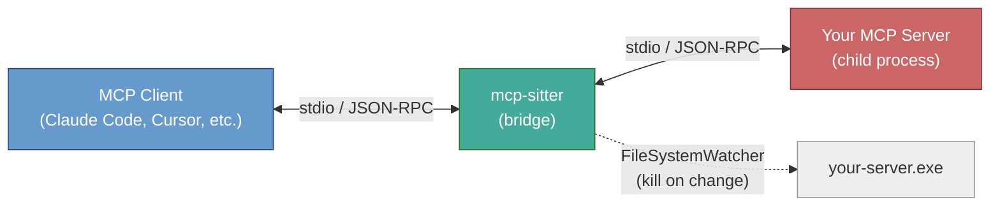
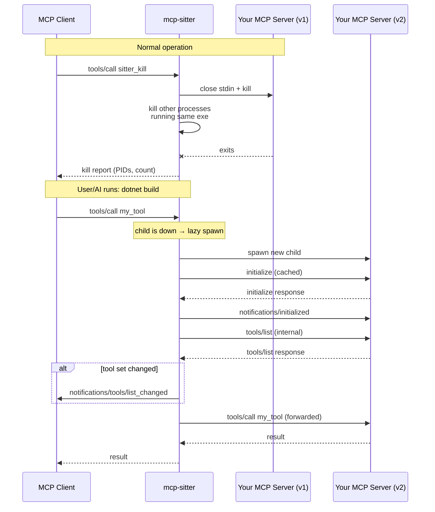

# mcp-sitter

A hot-reload bridge for stdio **Model Context Protocol (MCP)** servers, so you
can rebuild your MCP server during development **without restarting the MCP
client** (e.g. Claude Code, Claude Desktop, Cursor, Cline, etc).

Point your MCP client at `mcp-sitter` instead of your in-development server.
`mcp-sitter` spawns your server as a child process and forwards all JSON-RPC
messages transparently. When you need to rebuild, call `sitter_kill` to
unlock the binary (killing ALL processes running that exe, not just the
child). After the build, your next tool call **lazily respawns** the child.
If the tool set changed, `mcp-sitter` pushes a
`notifications/tools/list_changed` to the client so the AI sees your
new/updated tools on the very next turn.

No more "kill the MCP client, rebuild, restart the MCP client, re-open your
conversation, re-establish context" loop.

## Why

Building a stdio MCP server is frustrating:

1. Your MCP client locks the server binary while the server is running.
2. To rebuild, you have to kill the running server process (which the client
   owns), which usually means killing the client.
3. After the build succeeds, you have to restart the client to get the new
   server loaded.
4. You lose your conversation context every time.

`mcp-sitter` sits between the client and your server and owns the child
process lifecycle.

## Architecture



### Typical dev cycle



## Verified end-to-end

On 2026-04-12 with Claude Code we verified:

- Register `mcp-sitter` as a user-scope MCP server pointing at a dummy child.
- In a conversation: the child advertises 2 tools (+ 2 built-in `sitter_*`
  tools).
- Mid-conversation: call `sitter_kill`, change the child's toolset, rebuild.
- Next `tools/call` triggers lazy respawn.
- The new tool surfaces in Claude Code **inside the same conversation**, and
  the AI calls it successfully on the next turn.

**Result: zero client restarts required when the child's tool set changes.**

## Built-in tools

`mcp-sitter` exposes two tools of its own, merged into the child's
`tools/list` response:

| Tool            | What it does |
| --------------- | ------------ |
| `sitter_status` | Returns child state, watched path, uptime, spawn/kill counts. |
| `sitter_kill`   | Kills the child process AND all other processes running the same executable, so the binary is unlocked for rebuild. The child will be lazily respawned on the next tool call. |

Everything else (`tools/list`, `tools/call` for non-built-in tools, `ping`,
`notifications/*`, `resources/*`, `prompts/*`, etc.) is forwarded
transparently between the client and the child.

## Install / build

Requires .NET 9 SDK.

```powershell
git clone https://github.com/yotsuda/mcp-sitter.git
cd mcp-sitter
dotnet build -c Release
```

The executable lands at `bin/Release/net9.0/mcp-sitter.exe`.

## Register with Claude Code

```powershell
claude mcp add --scope user my-server `
    C:\path\to\mcp-sitter.exe `
    C:\path\to\your-mcp-server.exe [your-server-args...]
```

Then from any Claude Code session, your MCP server is available as
`mcp__my-server__*`. Rebuild your server at any time; the AI will see new
tools on its next turn.

## CLI

```
mcp-sitter [options] [--] <child-exe> [child-args...]
```

| Option           | Description |
| ---------------- | ----------- |
| `--watch <path>` | Path to the binary to watch. Defaults to `<child-exe>` if that resolves to an existing file. |
| `--debounce <ms>`| Debounce window for file-watcher events before killing the child. Default `1500`. |
| `--cwd <path>`   | Working directory for the child process. Defaults to `mcp-sitter`'s cwd. |
| `--help`, `-h`   | Show help. |

Use `--` to separate `mcp-sitter` options from the child command if any
child argument happens to start with `--`.

## How it works

### Lazy spawn

The child process is **not** eagerly restarted after being killed. Instead,
the next incoming `tools/call` or `tools/list` from the client triggers
a spawn:

1. Spawn the child with the same command line.
2. Replay the cached `initialize` request (with a new internal id so the
   response never leaks to the client) and `notifications/initialized`.
3. Issue an internal `tools/list` request and compare with the previously
   cached tool list. If they differ, send `notifications/tools/list_changed`
   to the client.
4. Forward the original request to the child.

This eliminates all debounce/timing issues with proactive reload — no risk
of respawning while the build is still writing files.

### File watcher

`FileSystemWatcher` monitors the child binary for changes. When the binary
is updated (e.g. on Linux where a running exe is not locked, or after
`sitter_kill` unlocked it on Windows), the watcher kills the child after a
debounce period. The child will be lazily respawned on the next tool call.

### `sitter_kill`

Kills all processes running the watched executable — not just the child
`mcp-sitter` spawned. This ensures the binary is fully unlocked for the
build tool. Process matching is by `MainModule.FileName` comparison.

### During downtime

While the child is down, incoming `tools/call` requests trigger a lazy
respawn (which may take a moment). Incoming `tools/list` requests are served
from the bridge's cache (merged with the built-in tools) if the spawn fails,
so the AI's tool roster stays stable.

## Limitations

- **Stateful children lose state across restart.** Session ids,
  subscriptions, in-memory caches, resource watches, etc. are gone after
  respawn. For pure "tools over data" servers this is a non-issue.
- **Only `tools/list_changed` is actively surfaced.** Changes to
  `resources/*` or `prompts/*` pass through transparently but the bridge
  does not issue a `notifications/resources/list_changed` after respawn on
  its own (yet).
- **Windows-tested.** The code uses no Windows-only APIs and should work on
  Linux/macOS, but that hasn't been verified yet.
- **One child per bridge instance.** The child command is fixed at bridge
  startup; to supervise multiple MCP servers, register multiple `mcp-sitter`
  instances with different names.

## Project layout

```
mcp-sitter/
  Program.cs         entry + CLI help
  Sitter.cs          core: stdio pumps, message routing, child lifecycle,
                     file watcher, lazy spawn + handshake replay
  SitterTools.cs     sitter_status / sitter_kill tool definitions
  SitterConfig.cs    CLI argument parsing
  Log.cs             stderr logger
  McpSitter.csproj   net9.0 console app (builds mcp-sitter.exe)
  test/
    FakeMcp/         minimal stdio MCP server used for integration tests
    smoke-test.ps1   kill + lazy-respawn smoke test
    watch-test.ps1   file-watcher kill + lazy-respawn test
```

The .NET namespace and types are `McpSitter` / `Sitter` (PascalCase, .NET
convention). The binary and user-facing CLI name are `mcp-sitter`
(kebab-case, ecosystem convention).

## License

MIT — see [LICENSE](LICENSE).
