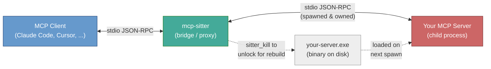
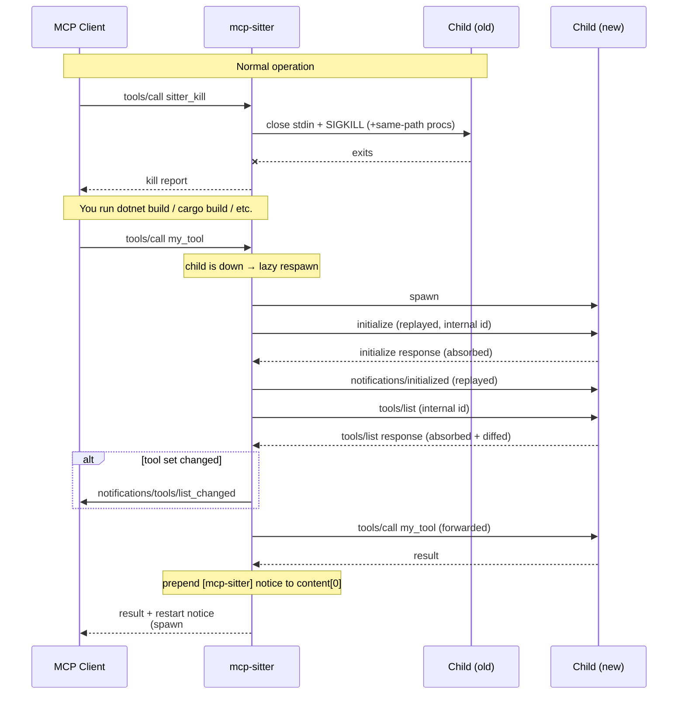
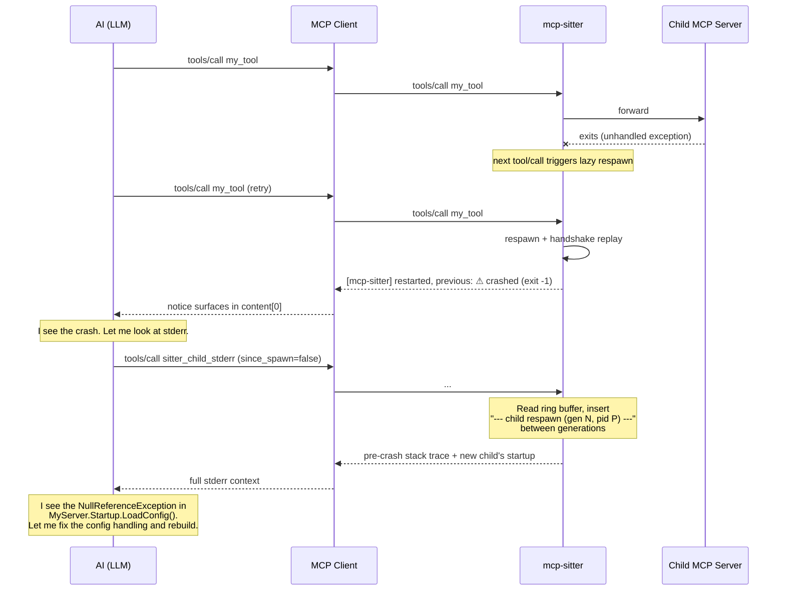

# mcp-sitter

A hot-reload bridge for stdio **Model Context Protocol (MCP)** servers, so you
can rebuild your MCP server during development **without restarting the MCP
client** (e.g. Claude Code, Claude Desktop, Cursor, Cline, etc).

<div align="center">
  
</div>

Install `mcp-sitter` (`npm install -g mcp-sitter`), then point Claude Code
at it:

```powershell
claude mcp add --scope user my-baby-dev `
    mcp-sitter `
    C:\path\to\my-baby-mcp.exe [args...]
```

That's the entire setup. Your tools are now available as `mcp__my-baby-dev__*`.
Rebuild your server any time — call `sitter_kill` to unlock the binary, run
your build, and the next tool call lazily respawns the child. No client
restart, no lost conversation context, and the AI sees a `[mcp-sitter]`
notice with the tools-diff so it self-corrects after schema changes.

> Other MCP clients (Claude Desktop, Cursor, Cline, ...) work the same way:
> point the client at `mcp-sitter` and pass your server exe + args.
> Building from source instead? See [Build from source](#build-from-source).

Point your MCP client at `mcp-sitter` instead of your in-development server.
`mcp-sitter` spawns your server as a child process and proxies all JSON-RPC
messages. When you need to rebuild, call `sitter_kill` to unlock the binary
(killing **all** processes running that exe, not just the child). After the
build, your next `tools/call` **lazily respawns** the child and, if the tool
set changed, pushes `notifications/tools/list_changed` to the client.

More importantly, **the first tool/call response after a respawn gets a
`[mcp-sitter]` notice prepended to its `content` array**, telling the AI:

- how many times the server has been restarted,
- how long the startup took,
- what version/build-date the new binary has,
- whether the previous instance crashed,
- and **exactly which tools were added / removed / changed**.

This makes the AI **self-correcting**: if you renamed a tool or changed a
schema, the AI sees the diff in the same response as any error, and retries
with the correct name/shape automatically.

No more "kill the MCP client, rebuild, restart the MCP client, re-open your
conversation, re-establish context" loop.

## Why

Building a stdio MCP server is frustrating:

1. Your MCP client locks the server binary while the server is running.
2. To rebuild, you have to kill the running server process, which usually
   means killing the client (since the client owns it).
3. After the build succeeds, you have to restart the client to get the new
   server loaded.
4. You lose your conversation context every time.

`mcp-sitter` sits between the client and your server and owns the child
process lifecycle independently of the client.

## How mcp-sitter is different from other MCP hot-reload tools

Unlike simple `stdin: inherit` passthrough wrappers:

- **Correct handshake replay.** `initialize` and `notifications/initialized`
  are cached on the very first client handshake and re-sent to the respawned
  child with internal request ids, so the child is always properly
  initialized — even with strict MCP server implementations.
- **Tools-diff awareness.** `mcp-sitter` issues an internal `tools/list` on
  respawn, diffs against the previous list by tool name and schema, and
  surfaces the result both as `notifications/tools/list_changed` (for the
  client infra's tool cache) and as a `[mcp-sitter]` content notice on the
  next tool/call response (for the AI itself).
- **Content-level notices.** MCP clients aren't guaranteed to surface
  protocol notifications to the LLM. `mcp-sitter` injects a short text
  block at `content[0]` of the next tool/call response so the AI always
  sees that a restart happened and what changed.

## Architecture



### Lazy respawn sequence



### Typical dev cycle

1. Client sends `tools/call sitter_kill` (or you rebuild directly).
2. `mcp-sitter` closes stdin on the child, waits 300 ms, then `SIGKILL`s if
   needed; it also kills every other process on the machine running the
   same `MainModule.FileName`, so the binary is fully unlocked.
3. You (or your AI) runs `dotnet build` / `cargo build` / `npm run build` /
   whatever produces the new server binary.
4. Client sends `tools/call my_tool`. The child is down, so `mcp-sitter`:
   - spawns a new child,
   - replays the cached `initialize` + `notifications/initialized`
     using an internal request id (the response never leaks to the client),
   - issues an internal `tools/list` and computes a diff vs. the last known
     tool set,
   - sends `notifications/tools/list_changed` to the client if the diff is
     non-empty,
   - forwards the original tool/call to the child,
   - receives the response, and
   - **prepends a `[mcp-sitter]` notice** to the response's `content` array
     with spawn #, startup time, binary version/age, previous exit info,
     and the tools diff.

The client surfaces the merged response to the AI on the very next turn —
inside the same conversation, with no restart.

## Example restart notice

A typical notice (one text block, pre-pended to the first tool/call response
after a respawn):

```
[mcp-sitter] server restarted (spawn #3, pid 12345, startup 1.8s).
path: C:\dev\my-server\dist\my-server.exe.
binary v1.2.3+abc123 built 2 min ago. previous: exit 0 after 45s.
tools: +1 added (search_index), 1 schema changed (read_file).
```

Crash-after-respawn:

```
[mcp-sitter] server restarted (spawn #4, pid 12346, startup 0.9s).
path: C:\dev\my-server\dist\my-server.exe.
binary built 5 min ago. previous: ⚠ crashed (exit -1073741819) after 2.1s.
```

## Crash self-diagnosis flow

When a child crashes on startup or mid-session, `mcp-sitter` turns the usual
"invisible exit code" into something the AI can act on. The child's stderr
(usually where .NET/Node/Python dump unhandled exceptions) is buffered in a
1000-line ring persisted across respawns, and exposed via
`sitter_child_stderr`. Combined with `sitter_status`, this lets the AI
diagnose and fix its own server without the developer even noticing:



Because the stderr ring survives respawns and the delimiter clearly marks
the boundary, the AI sees *both* the crashed generation's stack trace *and*
the fresh generation's output in the same response. No developer
intervention, no `strace`-equivalent setup, no log file plumbing.

## Testing

Integration tests are **Pester v5** scenarios in
[`test/McpSitter.Tests.ps1`](test/McpSitter.Tests.ps1), running against a
minimal stdio MCP server ([`test/FakeMcp`](test/FakeMcp)) over the real
JSON-RPC handshake:

- `mcp-sitter core` — tools/list merging, tool forwarding, `sitter_kill` +
  lazy respawn with `[mcp-sitter]` restart notice injection, post-respawn
  `sitter_status` deltas.
- `sitter_child_stderr` — startup stderr capture, mid-lifecycle lines via
  a `fake_log` tool, `since_spawn=true` filter, `since_spawn=false` with a
  `----- child respawn (gen N, pid P) -----` delimiter between generations.

```bash
dotnet build -c Debug
dotnet build test/FakeMcp/FakeMcp.csproj -c Debug
Invoke-Pester test/McpSitter.Tests.ps1 -Output Detailed
```

CI runs the same Pester suite on **Windows / Ubuntu / macOS** matrix
via [`.github/workflows/ci.yml`](.github/workflows/ci.yml). Tagged
releases run `.github/workflows/release.yml` — a three-job flow that
NativeAOT-publishes for each RID (win-x64 / linux-x64 / osx-arm64),
Authenticode-signs the Windows binary via Azure Key Vault on a
Windows runner, and publishes three platform-specific npm
sub-packages (`mcp-sitter-win32-x64`, `mcp-sitter-linux-x64`,
`mcp-sitter-darwin-arm64`) plus the umbrella `mcp-sitter` package,
all with SLSA provenance. The umbrella resolves the matching
sub-package at runtime via its `optionalDependencies`.

## Built-in tools

`mcp-sitter` exposes four tools of its own, merged into the child's
`tools/list` response:

| Tool                  | What it does |
| --------------------- | ------------ |
| `sitter_status`       | Returns child state, binary path/version, child PID, per-spawn and sitter uptimes, spawn/kill counts (including external / crash deaths), last kill reason/time, last startup duration, previous exit info, and last tools-diff summary. |
| `sitter_kill`         | Kills the child AND every other process running the same executable, so the binary is unlocked for rebuild. The child is lazily respawned on the next tool call. |
| `sitter_binary_info`  | Returns version, build date (mtime), size, and metadata of the child binary. Use this to confirm which build is currently loaded and to detect stale binaries. |
| `sitter_child_stderr` | Tails the child MCP server's stderr from a bounded ring buffer (~1000 lines, persisted across respawns). Crucial for diagnosing child startup failures and crashes — pair with `sitter_status` after a non-zero `previousExitCode`. |

Everything else (`tools/list`, `tools/call` for non-built-in tools, `ping`,
`notifications/*`, `resources/*`, `prompts/*`, etc.) is forwarded
transparently between the client and the child.

## Build from source

Requires .NET 9 SDK. Most users should prefer the npm prebuilt binary shown
at the top of this README.

```powershell
git clone https://github.com/yotsuda/mcp-sitter.git
cd mcp-sitter
.\Build.ps1
```

The AOT binary lands at `dist/mcp-sitter.exe` (and is mirrored to
`npm/platforms/win32-x64/bin/mcp-sitter.exe` for the Windows npm
sub-package). The Linux sub-package is built fresh on the runner in CI
from the same `dotnet publish -c Release -r linux-x64` command.

## CLI

```
mcp-sitter [options] [--] <child-exe> [child-args...]
```

| Option         | Description |
| -------------- | ----------- |
| `--cwd <path>` | Working directory for the child process. Defaults to `mcp-sitter`'s cwd. |
| `--help`, `-h` | Show help. |

Use `--` to separate `mcp-sitter` options from the child command if any
child argument happens to start with `--`.

## How it works

### Lazy spawn

The child process is **not** eagerly restarted after being killed. Instead,
the next incoming `tools/call` or `tools/list` from the client triggers
a spawn:

1. Spawn the child with the same command line.
2. Replay the cached `initialize` request with a fresh internal id (the
   response is absorbed via the bridge's pending-request table and never
   leaks to the client) and forward the cached `notifications/initialized`.
3. Issue an internal `tools/list` request and diff the response by tool
   name and schema against the previous cache. If diff is non-empty, send
   `notifications/tools/list_changed` to the client and stash the diff
   summary for the next restart notice.
4. Forward the original client request to the child.
5. When the child responds to the original request, prepend a
   `[mcp-sitter]` notice to `result.content[0]` and forward.

This eliminates all timing issues with proactive reload — no risk of
respawning while the build is still writing files.

### `sitter_kill`

Kills all processes running the child executable — not just the one
`mcp-sitter` spawned. This ensures the binary is fully unlocked for the
build tool. Process matching is by `MainModule.FileName` comparison
(case-insensitive, full-path).

### During downtime

While the child is down, incoming `tools/call` requests trigger a lazy
respawn (which may take a moment). Incoming `tools/list` requests are served
from the bridge's cache (merged with the built-in tools) if the spawn fails,
so the AI's tool roster stays stable.

## Limitations

- **Stateful children lose state across restart.** Session ids,
  subscriptions, in-memory caches, resource watches, etc. are gone after
  respawn. For pure "tools over data" servers this is a non-issue.
- **Only `tools/list_changed` is actively surfaced.** Changes to
  `resources/*` or `prompts/*` pass through transparently but the bridge
  does not issue a `notifications/resources/list_changed` after respawn on
  its own (yet).
- **Platform coverage.** v0.2.0 ships `win32-x64`, `linux-x64`, and
  `darwin-arm64` (Apple Silicon) native binaries. Intel Mac is not
  shipped — the `macos-13` GHA runner pool is too contended to
  practically build against. The Windows binary is Authenticode-signed
  by the project's code-signing cert via Azure Key Vault; Linux and
  macOS binaries ship unsigned (neither OS has equivalent mandatory
  signature verification, and all three platforms are covered by npm
  SLSA provenance).
- **One child per bridge instance.** The child command is fixed at bridge
  startup; to supervise multiple MCP servers, register multiple `mcp-sitter`
  instances with different names.
- **Restart notice is only injected when the response has a `result.content`
  array** (= tool-level response). JSON-RPC error responses (the `error`
  field at the envelope level) are forwarded unchanged; the notification
  via `notifications/tools/list_changed` still reaches the client infra.

## Project layout

```
mcp-sitter/
  Program.cs                        entry + CLI help
  Sitter.cs                         core: stdio pumps, message routing,
                                    child lifecycle, lazy spawn +
                                    handshake replay, restart notice,
                                    tools-diff, stderr ring buffer
  SitterTools.cs                    sitter_status / sitter_kill /
                                    sitter_binary_info / sitter_child_stderr
                                    tool definitions
  SitterConfig.cs                   CLI argument parsing
  Log.cs                            stderr logger
  McpSitter.csproj                  net9.0 console app (AOT-published)
  Build.ps1                         local dev build
  .github/workflows/ci.yml          Pester matrix (win/linux/macOS)
  .github/workflows/release.yml     AOT build → Azure KV sign (Windows)
                                    → npm publish + GitHub release
  test/
    McpSitter.Tests.ps1             Pester v5 integration tests
    FakeMcp/                        minimal stdio MCP server for tests
  npm/
    package.json                    umbrella mcp-sitter; optionalDependencies
                                    pin all 3 platform sub-packages
    bin/cli.mjs                     resolves mcp-sitter-<platform>-<arch>
                                    at runtime via require.resolve
    platforms/
      win32-x64/     package.json   mcp-sitter-win32-x64 (os/cpu pinned);
                                    bin/mcp-sitter.exe populated by CI
      linux-x64/     package.json   mcp-sitter-linux-x64; bin/ populated by CI
      darwin-arm64/  package.json   mcp-sitter-darwin-arm64; bin/ populated by CI
```

The .NET namespace and types are `McpSitter` / `Sitter` (PascalCase, .NET
convention). The binary and user-facing CLI name are `mcp-sitter`
(kebab-case, ecosystem convention).

## License

MIT — see [LICENSE](LICENSE).
